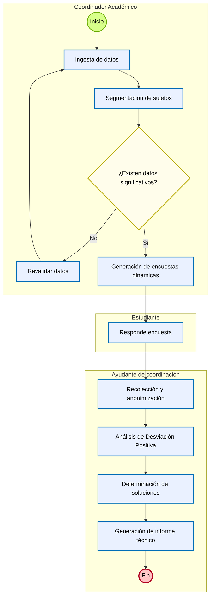

# Elicitación de Requisitos  

## Plataforma de Desviación Positiva para la Reducción de la Deserción en la ESPE

**Versión:** 1.0  
**Fecha base del documento:** 16 de abril de 2026  
**Documento base utilizado:** Documento de Requerimientos  
**Código de requerimiento:** RF-ESPE-DP-2025-001  
**Institución:** Universidad de las Fuerzas Armadas ESPE  
**Departamento:** Departamento de Ciencias de la Computación - Carrera de Ingeniería de Software  

---

## 1. Información General del Proyecto

### 1.1 Nombre del proyecto

**Marco de Trabajo y Plataforma de Desviación Positiva para la Reducción de la Deserción en la ESPE.**

### 1.2 Responsables

| Nombre | Rol |
|---|---|
| Cristian Jose Acalo Cruz | Elicitador y Desarrollador |

### 1.3 Tipo de requerimiento

| Tipo | Aplica |
|---|---:|
| Nuevo sistema | Sí |
| Reporte | Sí |
| Carga masiva de datos | Sí |
| Cambio en sistema actual | No especificado |
| Solicitud de información | No especificado |

---

## 2. Descripción Funcional del Requerimiento

### 2.1 Objetivo

Desarrollar una plataforma que automatice la identificación de desviaciones positivas mediante el análisis de notas por NRC, generando encuestas dinámicas para extraer y replicar estrategias de éxito académico.

### 2.2 Justificación

El enfoque tradicional de análisis académico se centra en las deficiencias del estudiante, dejando de lado las soluciones que ya funcionan dentro del aula. Capturar el conocimiento tácito de los estudiantes que logran resultados sobresalientes permitirá identificar prácticas replicables para reducir la deserción prevenible.

### 2.3 Problema actual

Existe una tasa de deserción estimada entre el 15% y el 25% en carreras técnicas. Actualmente, no existe un mecanismo institucional para documentar sistemáticamente qué hacen diferente los estudiantes que logran excelencia académica en condiciones adversas.

### 2.4 Proceso propuesto

1. **Ingesta de datos:** carga masiva de notas correspondientes a un NRC específico, sin importar la carrera.
2. **Segmentación:** clasificación automática de estudiantes en grupos de rendimiento alto, medio o bajo, basada exclusivamente en calificaciones.
3. **Encuestado dinámico:** generación y envío de encuestas diferenciadas según el grupo asignado.
4. **Análisis de desviación:** procesamiento de respuestas para aislar comportamientos del grupo de alto rendimiento que puedan ser transferidos al resto.
5. **Generación de informe:** entrega de resultados con motivos de éxito, causas de riesgo y propuestas de solución específicas para el NRC o materia analizada.

---

## 3. Alcance del Sistema

El sistema contempla el desarrollo de una solución tecnológica para la Universidad de las Fuerzas Armadas ESPE, orientada a la detección y gestión de prácticas de éxito académico mediante el modelo de Desviación Positiva.

El alcance incluye:

- Ingesta de registros académicos por NRC.
- Segmentación estadística de estudiantes.
- Administración de encuestas dinámicas.
- Aplicación de protocolos de anonimización y blindaje ético.
- Análisis de patrones de éxito académico.
- Generación de informes y hojas de ruta basadas en prácticas exitosas detectadas.
- Visualización de resultados por NRC, materia o carrera.
- Protección de datos personales conforme a la LOPDP.

---

## 4. Módulos del Sistema

| Código | Módulo | Descripción |
|---|---|---|
| MOD-ING | Ingesta de Datos | Carga de historial académico por NRC. |
| MOD-SEG | Segmentación y Agrupación de Sujetos | Clasificación automática de estudiantes por rendimiento. |
| MOD-ENC | Generador Dinámico de Encuestas | Creación y aplicación de encuestas diferenciadas por grupo. |
| MOD-ANL | Motor de Análisis de Desviación Positiva y Soluciones | Identificación de patrones de éxito y generación de propuestas académicas. |

---

## 5. Actores del Sistema

| Actor | Descripción | Responsabilidades principales |
|---|---|---|
| Coordinador Académico | Usuario de gestión académica. | Validar la significancia estadística de la muestra, revisar resultados y tomar decisiones académicas. |
| Ayudante de Coordinación | Usuario de apoyo técnico-operativo. | Gestionar la carga de datos y apoyar el flujo operativo del análisis. |
| Administrador del Sistema | Usuario con permisos administrativos. | Gestionar accesos, configuración y operación general del sistema. |
| Investigador | Usuario encargado del análisis académico. | Consultar resultados, interpretar hallazgos y revisar reportes. |
| Estudiante | Respondiente de encuestas. | Completar encuestas asignadas según su grupo de rendimiento. |
| Docente | Receptor de resultados académicos. | Revisar recomendaciones y decidir cómo aplicarlas en su contexto académico. |
| Director del Proyecto | Responsable de seguimiento general. | Revisar reportes consolidados y resultados estratégicos. |
| Sistema | Actor automático. | Ejecutar procesos de segmentación, generación de encuestas, análisis y reportes. |

---

## 6. Reglas de Negocio Generales

| ID | Regla de negocio |
|---|---|
| RN-01 | Se define como **desviante positivo** al estudiante con nota mayor a 8.5/10 dentro de un entorno de bajo promedio general. |
| RN-02 | Cada NRC debe tratarse como una unidad de análisis aislada. |
| RN-03 | El sistema podrá consolidar información por materia o carrera, siempre que mantenga la trazabilidad del NRC de origen. |
| RN-04 | Todo procesamiento de datos para análisis deberá realizarse sin nombres ni IDs públicos. |
| RN-05 | Las preguntas enviadas a cada grupo de rendimiento deberán ser mutuamente excluyentes. |
| RN-06 | La segmentación de estudiantes debe basarse exclusivamente en calificaciones. |
| RN-07 | El sistema no debe utilizar datos socioeconómicos, emocionales, de salud, género u otros factores externos para clasificar o analizar estudiantes. |
| RN-08 | Las recomendaciones generadas deben basarse en patrones detectados en el grupo de desviación positiva. |
| RN-09 | Las soluciones propuestas deben estar respaldadas por patrones que aparezcan en al menos el 60% del grupo de desviación positiva. |
| RN-10 | Los reportes descargables deben cumplir con la LOPDP y no deben permitir la reidentificación de estudiantes. |

---

## 7. Condiciones Especiales

| ID | Condición |
|---|---|
| CE-01 | El uso de historiales de notas del sistema GACAD requiere autorización de Secretaría Académica. |
| CE-02 | El proyecto debe contar con aval del Comité de Ética de la universidad para la aplicación de encuestas a humanos. |
| CE-03 | La plataforma debe asegurar la integridad de la información académica utilizada. |
| CE-04 | La plataforma debe proteger la privacidad de los estudiantes durante todo el proceso de análisis. |

---

# 8. Requisitos Funcionales

---

## RF-01. Gestión e Ingesta de Calificaciones por NRC

| Campo | Detalle |
|---|---|
| **ID** | RF-01 |
| **Nombre** | Gestión e Ingesta de Calificaciones por NRC, Materia, Carrera |
| **Prioridad** | Alta / Crítica |
| **Actor(es)** | Administrador del Sistema / Investigador |
| **Módulo relacionado** | MOD-ING |

### Descripción

El sistema debe permitir la carga del historial académico, incluyendo calificaciones parciales y finales, de los estudiantes pertenecientes a un NRC específico. La funcionalidad debe ser agnóstica, permitiendo procesar datos de cualquier materia o carrera de la institución.

### Precondiciones

- El usuario debe tener acceso autorizado a los datos del sistema académico GACAD.
- El archivo de origen debe contener el identificador del NRC.
- El archivo de origen debe contener el listado de notas por estudiante.

### Entradas

- Identificador único del NRC.
- Listado de calificaciones de los estudiantes vinculados al NRC.

### Procesos

1. Validar que el archivo cumpla con la estructura requerida.
2. Importar los registros a la base de datos del sistema.
3. Etiquetar la información para permitir análisis por NRC, materia o carrera.

### Salidas

- Base de datos poblada con las calificaciones del NRC.
- Confirmación de carga exitosa.
- Reporte de errores en caso de fallos de formato, datos incompletos o carga incorrecta.

### Exclusiones

- El sistema no debe procesar datos socioeconómicos, emocionales o de salud durante esta fase.
- El sistema no debe permitir la modificación manual de las notas una vez importadas.
- El sistema no debe almacenar nombres o números de cédula legibles en la base de datos de análisis.
- El módulo no debe limitar la carga a una sola facultad o departamento.

### Reglas de negocio asociadas

- El sistema debe aceptar notas de cualquier carrera sin requerir cambios en la lógica del sistema.
- Los datos deben ser tratados bajo protocolos de ciberseguridad institucionales.
- La información importada debe conservar integridad para fines de auditoría.

### Criterios de aceptación

- Dado un archivo válido con NRC y notas, cuando el usuario realice la carga, entonces el sistema debe registrar los datos correctamente.
- Dado un archivo inválido, cuando el usuario intente cargarlo, entonces el sistema debe mostrar un reporte de errores.
- Dado un archivo cargado correctamente, cuando finalice el proceso, entonces las notas no deben poder ser modificadas manualmente desde la plataforma.
- Dado un conjunto de notas de cualquier carrera, cuando se cargue al sistema, entonces el sistema debe aceptarlo sin restricciones por facultad o departamento.

---

## RF-02. Segmentación y Agrupación Automática por Rendimiento

| Campo | Detalle |
|---|---|
| **ID** | RF-02 |
| **Nombre** | Segmentación y Agrupación Automática por Rendimiento |
| **Prioridad** | Alta |
| **Actor(es)** | Sistema |
| **Módulo relacionado** | MOD-SEG |

### Descripción

El sistema debe clasificar automáticamente a los estudiantes del NRC cargado en grupos diferenciados basados exclusivamente en su desempeño académico. Esta agrupación es el paso previo para la generación de encuestas dinámicas.

### Precondiciones

- El RF-01 debe haberse ejecutado exitosamente.
- Las calificaciones deben estar disponibles en la base de datos del sistema.

### Entradas

- Registro de calificaciones del NRC procesado en el RF-01.

### Procesos

1. Calcular el promedio actual o final del estudiante dentro del NRC específico.
2. Aplicar umbrales lógicos para asignar al estudiante a un grupo de rendimiento.
3. Etiquetar a cada estudiante con un grupo, como Alto Rendimiento, Promedio o En Riesgo.
4. Registrar el grupo asignado para habilitar el módulo de encuestas.

### Salidas

- Base de datos actualizada con la asignación de grupo por cada estudiante del NRC.

### Exclusiones

- No se deben considerar variables socioeconómicas, de género, emocionales o de salud.
- El usuario no debe poder mover estudiantes entre grupos de forma arbitraria.
- El sistema no debe mezclar promedios de diferentes carreras para definir umbrales de un NRC específico.

### Reglas de negocio asociadas

- Se clasificará como desviación positiva al estudiante con promedio mayor a 8.5/10 dentro del NRC analizado.
- Se clasificará como estudiante en riesgo a quien tenga notas inferiores a la media aprobatoria de la materia o promedios menores a 6/10.
- Los grupos deben manejarse como conjuntos de datos anonimizados para el motor de análisis.

### Criterios de aceptación

- Dado un NRC con calificaciones cargadas, cuando el sistema ejecute la segmentación, entonces cada estudiante debe recibir una etiqueta de rendimiento.
- Dado un estudiante con promedio mayor a 8.5/10, cuando se aplique la segmentación, entonces debe ser identificado como posible desviante positivo.
- Dado un estudiante con promedio menor a 6/10, cuando se aplique la segmentación, entonces debe ser identificado como estudiante en riesgo.
- Dado un usuario administrativo, cuando intente modificar manualmente la clasificación, entonces el sistema debe impedirlo.

---

## RF-03. Generación Dinámica y Aplicación de Encuestas por Grupo

| Campo | Detalle |
|---|---|
| **ID** | RF-03 |
| **Nombre** | Generación Dinámica y Aplicación de Encuestas por Grupo |
| **Prioridad** | Alta |
| **Actor(es)** | Sistema / Estudiante |
| **Módulo relacionado** | MOD-ENC |

### Descripción

El sistema debe crear automáticamente instrumentos de recolección de datos diferenciados para cada grupo de rendimiento detectado en el RF-02. Las encuestas deben distribuirse y aplicarse digitalmente a los estudiantes del NRC para identificar prácticas de éxito o barreras académicas.

### Precondiciones

- El RF-02 debe haber finalizado con la asignación de etiquetas de rendimiento a cada estudiante del NRC.

### Entradas

- Etiquetas de grupo por estudiante.
- Plantillas de preguntas técnicas y metodológicas precargadas en el sistema.

### Procesos

1. Seleccionar el cuestionario correspondiente según la etiqueta del estudiante.
2. Notificar y habilitar el formulario dentro de la plataforma.
3. Capturar las respuestas del estudiante.
4. Almacenar los datos recolectados vinculándolos al ID anonimizado del sujeto.

### Salidas

- Registro de respuestas completas.
- Dashboard de estado de cumplimiento por NRC.
- Porcentaje de encuestas respondidas por NRC.

### Exclusiones

- No se deben incluir preguntas sobre situación socioeconómica, estado emocional, salud o factores ajenos a lo académico.
- Un estudiante de alto rendimiento no debe recibir el cuestionario diseñado para el grupo en riesgo.
- El formulario no debe solicitar nombres, cédulas, correos u otros datos identificativos.

### Reglas de negocio asociadas

- Las encuestas para el grupo de éxito deben centrarse en cómo lo logró: recursos, métodos y prácticas académicas.
- Las encuestas para el grupo en riesgo deben centrarse en qué dificultades encontró.
- El sistema debe poder aplicar encuestas a cualquier NRC de cualquier carrera sin modificar la lógica interna.

### Criterios de aceptación

- Dado un estudiante etiquetado como alto rendimiento, cuando acceda a la encuesta, entonces debe recibir únicamente el cuestionario correspondiente a su grupo.
- Dado un estudiante etiquetado como en riesgo, cuando acceda a la encuesta, entonces debe recibir únicamente el cuestionario correspondiente a su grupo.
- Dado un formulario de encuesta, cuando el estudiante lo complete, entonces el sistema debe almacenar las respuestas sin datos identificativos.
- Dado un NRC con encuestas enviadas, cuando el coordinador revise el avance, entonces debe visualizar el porcentaje de respuestas recibidas.

---

## RF-04. Motor de Análisis de Desviación y Generación de Soluciones

| Campo | Detalle |
|---|---|
| **ID** | RF-04 |
| **Nombre** | Motor de Análisis de Desviación y Generación de Soluciones |
| **Prioridad** | Alta / Valor de negocio |
| **Actor(es)** | Sistema / Investigador |
| **Módulo relacionado** | MOD-ANL |

### Descripción

El sistema debe realizar un análisis cruzado entre las calificaciones del NRC y las respuestas de las encuestas dinámicas para identificar patrones de éxito. Con base en estos patrones, debe generar un informe automatizado con motivos de éxito, posibles causas de riesgo y soluciones replicables para el docente o la carrera.

### Precondiciones

- Debe existir una carga exitosa de notas por NRC.
- Deben existir respuestas de encuestas con una muestra representativa de cada grupo.

### Entradas

- Dataset de calificaciones segmentadas.
- Respuestas cualitativas y cuantitativas de las encuestas dinámicas por grupo.

### Procesos

1. Identificar recursos y hábitos comunes reportados por el grupo de alto rendimiento.
2. Contrastar herramientas usadas por estudiantes exitosos frente a barreras reportadas por el grupo en riesgo.
3. Calcular la significancia estadística de los hallazgos.
4. Sintetizar recomendaciones basadas en prácticas detectadas como exitosas.

### Salidas

- Informe de diagnóstico por NRC, materia o carrera.
- Propuesta de Hoja de Ruta de Éxito.
- Listado de recursos y métodos validados por la desviación positiva.

### Exclusiones

- El sistema no debe inferir causas socioeconómicas, emocionales o psicológicas.
- La lógica de análisis no debe sesgarse por carrera.
- El motor no debe generar juicios de valor sobre docentes o estudiantes.
- El análisis debe centrarse en soluciones técnicas y pedagógicas.

### Reglas de negocio asociadas

- El sistema debe permitir agrupar reportes por NRC, materia o carrera.
- Las soluciones propuestas deben estar respaldadas por patrones presentes en al menos el 60% del grupo de desviación positiva.
- La significancia estadística debe ser considerada dentro del análisis de hallazgos.

### Criterios de aceptación

- Dado un NRC con notas y encuestas procesadas, cuando se ejecute el análisis, entonces el sistema debe identificar patrones comunes del grupo de alto rendimiento.
- Dado un patrón identificado en menos del 60% del grupo de desviación positiva, cuando se generen soluciones, entonces el sistema no debe presentarlo como recomendación validada.
- Dado un hallazgo académico, cuando se genere el informe, entonces no debe incluir inferencias sobre salud, emociones o condición socioeconómica.
- Dado un análisis finalizado, cuando el investigador consulte resultados, entonces debe poder visualizar motivos de éxito, causas de riesgo académico y propuestas de solución.

---

## RF-05. Generación de Reportes y Visualización de Soluciones Académicas

| Campo | Detalle |
|---|---|
| **ID** | RF-05 |
| **Nombre** | Generación de Reportes y Visualización de Soluciones Académicas |
| **Prioridad** | Alta |
| **Actor(es)** | Director del Proyecto / Coordinador Académico / Docente |
| **Módulo relacionado** | MOD-ANL |

### Descripción

El sistema debe presentar los resultados del análisis de forma estructurada mediante un dashboard y reportes descargables. Estos resultados deben detallar estrategias de éxito identificadas, causas técnicas del bajo rendimiento y recomendaciones específicas para el NRC, materia o carrera analizada.

### Precondiciones

- El RF-04 debe haber procesado los datos y generado conclusiones estadísticas sobre las brechas de rendimiento.

### Entradas

- Conclusiones del motor de análisis.
- Metadatos del NRC: materia, carrera y departamento.

### Procesos

1. Renderizar métricas de impacto y frecuencias de uso de recursos en gráficos interactivos.
2. Organizar la Hoja de Ruta de Éxito, incluyendo motivos de éxito y causas de riesgo.
3. Generar documentos en formatos estándar para socialización académica.

### Salidas

- Dashboard interactivo de resultados por NRC, materia o carrera.
- Reporte PDF de prácticas académicas exitosas.
- Recomendaciones académicas descargables.

### Exclusiones

- El reporte final no debe incluir nombres de estudiantes.
- El reporte final no debe identificar a los desviantes positivos.
- El reporte no debe listar causas socioeconómicas o emocionales.
- El reporte debe limitarse a información académica y técnica.

### Reglas de negocio asociadas

- El sistema debe permitir filtrar la visualización desde un solo paralelo hasta el rendimiento consolidado de una carrera.
- Los reportes descargables deben cumplir estrictamente con la LOPDP.
- Ningún dato del reporte debe permitir reidentificar a los estudiantes.

### Criterios de aceptación

- Dado un análisis finalizado, cuando el coordinador consulte el dashboard, entonces debe visualizar resultados por NRC, materia o carrera.
- Dado un reporte generado, cuando se descargue, entonces no debe incluir nombres, cédulas, correos ni identificadores públicos de estudiantes.
- Dado un reporte académico, cuando se revise su contenido, entonces debe incluir prácticas exitosas y recomendaciones, sin causas socioeconómicas o emocionales.
- Dado un usuario autorizado, cuando filtre resultados, entonces debe poder visualizar información desde un paralelo específico hasta datos consolidados por carrera.

---

# 9. Requisitos No Funcionales

---

## 9.1 Seguridad y Privacidad

| ID | Requisito | Descripción | Prioridad |
|---|---|---|---|
| RNF-01 | Cumplimiento LOPDP | El sistema debe cumplir estrictamente con la Ley Orgánica de Protección de Datos Personales de Ecuador. | Crítica |
| RNF-02 | Anonimización irreversible | Los datos personales, como nombres e IDs, deben ser eliminados o enmascarados antes de pasar al motor de análisis y reportes. | Crítica |
| RNF-03 | Control de acceso | Solo usuarios autorizados podrán cargar NRCs y consultar información académica sensible. | Alta |

### Criterios de aceptación

- El sistema no debe exponer datos personales en reportes, dashboards o análisis.
- El sistema debe impedir el acceso a usuarios no autorizados.
- La información utilizada para análisis debe estar anonimizada antes de su procesamiento.

---

## 9.2 Rendimiento y Escalabilidad

| ID | Requisito | Descripción | Prioridad |
|---|---|---|---|
| RNF-04 | Escalabilidad académica | El sistema debe permitir el análisis de cualquier NRC de cualquier carrera de la ESPE de forma agnóstica. | Alta |
| RNF-05 | Tiempo de respuesta | El procesamiento de un NRC, desde la ingesta hasta la segmentación, no debe superar los 10 segundos en condiciones normales de red. | Alta |
| RNF-06 | Concurrencia | El sistema debe soportar el acceso concurrente de al menos 250 estudiantes respondiendo encuestas simultáneamente sin degradación del servicio. | Alta |

### Criterios de aceptación

- El sistema debe procesar NRCs de distintas carreras sin requerir cambios internos.
- El proceso de ingesta y segmentación debe completarse en un tiempo máximo de 10 segundos bajo condiciones normales.
- El sistema debe mantener disponibilidad y estabilidad con al menos 250 estudiantes respondiendo encuestas al mismo tiempo.

---

## 9.3 Usabilidad y Experiencia de Usuario

| ID | Requisito | Descripción | Prioridad |
|---|---|---|---|
| RNF-07 | Accesibilidad y multi-idioma | El diseño debe ser inclusivo para personas con discapacidad y estar disponible en español e inglés. | Media / Alta |
| RNF-08 | Diseño responsivo | La plataforma de encuestas debe ser 100% funcional en dispositivos móviles Android e iOS. | Alta |

### Criterios de aceptación

- La plataforma debe poder ser utilizada en español e inglés.
- Las encuestas deben funcionar correctamente en dispositivos móviles.
- La interfaz debe considerar criterios de accesibilidad para usuarios con discapacidad.

---

# 10. Exclusiones del Proyecto

El sistema no contempla:

- Procesamiento de pagos de matrículas.
- Gestión de deudas académicas.
- Gestión de nómina docente.
- Reemplazo de la autonomía del profesor.
- Automatización de decisiones pedagógicas finales.
- Alteración de notas en la base de datos institucional original.
- Diagnóstico o terapia para problemas de salud mental.
- Diagnóstico o terapia para trastornos del aprendizaje.
- Compatibilidad con Internet Explorer o navegadores sin soporte moderno.
- Funcionamiento en modo fuera de línea.

---

# 11. Casos de Uso Principales

## CU-01. Cargar calificaciones por NRC

| Campo | Detalle |
|---|---|
| Actor principal | Administrador del Sistema / Investigador |
| Requisito relacionado | RF-01 |
| Descripción | Permite cargar el historial académico de estudiantes pertenecientes a un NRC específico. |
| Resultado esperado | Las calificaciones quedan registradas y disponibles para segmentación. |

### Flujo básico

1. El usuario autorizado ingresa a la plataforma.
2. Selecciona la opción de carga de datos por NRC.
3. Ingresa el identificador del NRC.
4. Carga el archivo con calificaciones.
5. El sistema valida el formato.
6. El sistema registra la información.
7. El sistema muestra confirmación o reporte de errores.

---

## CU-02. Segmentar estudiantes por rendimiento

| Campo | Detalle |
|---|---|
| Actor principal | Sistema |
| Requisito relacionado | RF-02 |
| Descripción | Clasifica automáticamente a los estudiantes según sus calificaciones. |
| Resultado esperado | Cada estudiante queda asignado a un grupo de rendimiento. |

### Flujo básico

1. El sistema toma las calificaciones cargadas.
2. Calcula promedios por estudiante.
3. Aplica umbrales definidos.
4. Asigna etiquetas de rendimiento.
5. Registra la clasificación en la base de datos.

---

## CU-03. Aplicar encuesta dinámica

| Campo | Detalle |
|---|---|
| Actor principal | Estudiante / Sistema |
| Requisito relacionado | RF-03 |
| Descripción | Permite que cada estudiante responda una encuesta según su grupo de rendimiento. |
| Resultado esperado | Las respuestas quedan registradas de forma anonimizada. |

### Flujo básico

1. El sistema identifica el grupo del estudiante.
2. Selecciona el cuestionario correspondiente.
3. El estudiante accede al formulario.
4. El estudiante responde la encuesta.
5. El sistema almacena las respuestas sin datos identificativos.

---

## CU-04. Analizar patrones de desviación positiva

| Campo | Detalle |
|---|---|
| Actor principal | Sistema / Investigador |
| Requisito relacionado | RF-04 |
| Descripción | Cruza calificaciones y respuestas para identificar prácticas de éxito académico. |
| Resultado esperado | Se generan hallazgos y soluciones replicables. |

### Flujo básico

1. El sistema toma las calificaciones segmentadas.
2. El sistema toma las respuestas de encuestas.
3. Identifica patrones comunes en estudiantes de alto rendimiento.
4. Contrasta barreras reportadas por estudiantes en riesgo.
5. Determina hallazgos significativos.
6. Genera propuestas de solución.

---

## CU-05. Consultar y descargar reportes

| Campo | Detalle |
|---|---|
| Actor principal | Coordinador Académico / Docente / Director del Proyecto |
| Requisito relacionado | RF-05 |
| Descripción | Permite visualizar resultados y descargar reportes académicos. |
| Resultado esperado | El usuario accede a dashboards y reportes anonimizados. |

### Flujo básico

1. El usuario autorizado ingresa al módulo de resultados.
2. Selecciona filtros por NRC, materia o carrera.
3. El sistema muestra métricas y recomendaciones.
4. El usuario descarga el reporte.
5. El sistema garantiza que el reporte no contenga datos identificativos.

---

# 12. Matriz de Trazabilidad

| Módulo | Requisito funcional | Requisitos no funcionales relacionados |
|---|---|---|
| MOD-ING | RF-01 | RNF-01, RNF-02, RNF-03, RNF-04, RNF-05 |
| MOD-SEG | RF-02 | RNF-01, RNF-02, RNF-04, RNF-05 |
| MOD-ENC | RF-03 | RNF-01, RNF-02, RNF-06, RNF-07, RNF-08 |
| MOD-ANL | RF-04 | RNF-01, RNF-02, RNF-04, RNF-05 |
| MOD-ANL | RF-05 | RNF-01, RNF-02, RNF-03, RNF-07, RNF-08 |

---

# 13. Supuestos

| ID | Supuesto |
|---|---|
| SP-01 | La ESPE podrá autorizar el acceso a historiales académicos desde GACAD. |
| SP-02 | Los estudiantes aceptarán participar en encuestas bajo lineamientos éticos. |
| SP-03 | Los datos de calificaciones estarán estructurados y disponibles para carga. |
| SP-04 | Los usuarios administrativos contarán con permisos institucionales para operar la plataforma. |
| SP-05 | Las respuestas de encuestas serán suficientes para identificar patrones significativos. |

---

# 14. Restricciones

| ID | Restricción |
|---|---|
| RS-01 | El sistema debe cumplir con la LOPDP. |
| RS-02 | El análisis no debe usar datos personales legibles. |
| RS-03 | La plataforma no debe alterar datos originales del sistema académico institucional. |
| RS-04 | La clasificación de rendimiento debe basarse únicamente en calificaciones. |
| RS-05 | La aplicación de encuestas a estudiantes requiere aval ético. |
| RS-06 | El sistema no debe emitir juicios personales sobre docentes o estudiantes. |

---

# 15. Riesgos Identificados

| ID | Riesgo | Impacto | Mitigación |
|---|---|---|---|
| R-01 | Datos académicos incompletos o mal estructurados. | Alto | Validar formato antes de la carga y emitir reporte de errores. |
| R-02 | Baja participación estudiantil en encuestas. | Alto | Implementar seguimiento de cumplimiento por NRC. |
| R-03 | Riesgo de reidentificación de estudiantes. | Crítico | Aplicar anonimización irreversible y excluir datos personales de reportes. |
| R-04 | Falta de significancia estadística en un NRC. | Medio / Alto | Permitir consolidación por materia o carrera cuando sea metodológicamente válido. |
| R-05 | Uso indebido de recomendaciones como decisiones automáticas. | Alto | Aclarar que el sistema recomienda, pero no reemplaza la decisión docente. |

---

# 16. Preguntas Abiertas

| ID | Pregunta |
|---|---|
| PA-01 | ¿Cuál será el formato oficial de archivo permitido para la carga de notas? |
| PA-02 | ¿Qué usuario institucional será responsable de aprobar la carga de datos por NRC? |
| PA-03 | ¿Cómo se definirá una muestra representativa mínima para procesar encuestas? |
| PA-04 | ¿Qué plantillas de preguntas se usarán inicialmente para cada grupo de rendimiento? |
| PA-05 | ¿Qué criterios usará la universidad para aprobar o descartar una recomendación generada? |
| PA-06 | ¿Qué periodo académico se tomará como base para la primera validación del sistema? |

---

# 17. Resumen de Requisitos

| Tipo | Cantidad |
|---|---:|
| Requisitos funcionales | 5 |
| Requisitos no funcionales | 8 |
| Reglas de negocio generales | 10 |
| Casos de uso principales | 5 |
| Exclusiones del proyecto | 10 |
| Riesgos identificados | 5 |
| Preguntas abiertas | 6 |

---

## 18. Diagrama de Flujo del Sistema

El siguiente flujo describe el proceso general del sistema, desde la ingesta de datos académicos hasta la generación del informe técnico final. El flujo está dividido por actores: Coordinador Académico, Estudiante y Ayudante de Coordinación.

### 18.1 Descripción textual del flujo

1. El Coordinador Académico inicia el proceso mediante la ingesta de datos académicos.
2. El sistema realiza la segmentación de sujetos según el rendimiento académico.
3. Se evalúa si existen datos significativos para continuar el análisis.
4. Si no existen datos significativos, el Coordinador Académico debe revalidar los datos y repetir la ingesta.
5. Si existen datos significativos, el sistema genera encuestas dinámicas.
6. El Estudiante responde la encuesta asignada según su grupo de rendimiento.
7. El Ayudante de Coordinación realiza la recolección y anonimización de las respuestas.
8. Se ejecuta el análisis de Desviación Positiva.
9. Se determinan soluciones a partir de los patrones encontrados.
10. Se genera el informe técnico final.
11. El proceso finaliza con la entrega del informe.

## 19. Conclusión

La plataforma propuesta busca identificar prácticas académicas exitosas dentro de la ESPE mediante el modelo de Desviación Positiva. El sistema se enfoca en analizar calificaciones por NRC, segmentar estudiantes, aplicar encuestas diferenciadas, detectar patrones de éxito y generar recomendaciones académicas accionables.

La solución debe preservar la privacidad de los estudiantes, cumplir con la LOPDP, evitar el uso de factores externos no académicos y entregar información útil para docentes, coordinadores e investigadores sin reemplazar la toma de decisiones pedagógicas humana.
